# JS Safe 6.0
在解的過程中只要加上另一位好友的 Payload 、註解一個 `if` 以及解決 CSP 長度問題，就可以取得 Flag  
後來參考別人的 Write-up 才解開題目，希望明年有辦法解開  
Co-Worker: [@jimchen5209](https://github.com/jimchen5209)

## Summary
You stumbled upon someone's "JS Safe" on the web. It's a simple HTML file that can store secrets in the browser's localStorage. This means that you won't be able to extract any secret from it (the secrets are on the computer of the owner), but it looks like it was hand-crafted to work only with the password of the owner…

## Files Provided
- js_safe_6.html

## File Analysis
使用 Chrome 瀏覽器開啟後可以看到一個酷炫畫面，並告訴你應該怎麼使用
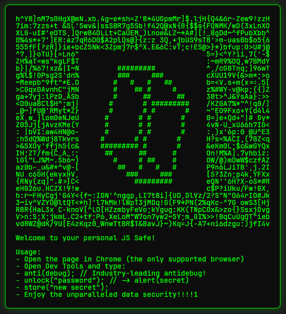
- Open the page in Chrome (the only supported browser)
- Open Dev Tools and type:
- anti(debug); // Industry-leading antidebug!
- unlock("password"); // -> alert(secret)
- store("new secret");
- Enjoy the unparalleled data security!!!!1

先依據畫面上的內容來分析 `.html` 檔案，因此我先去看相關的幾個函數是怎麼寫的

### Functions
#### anti(debug)
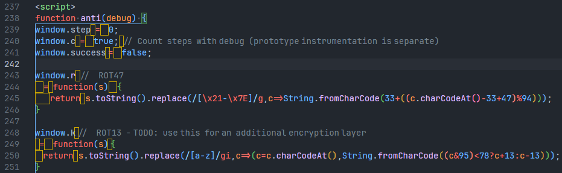
初次使用 VSCode 開啟會得到非常多的黃色方框，游標滑上去會看到這樣子的訊息
```
The character U+2003 is invisible. Adjust settings
```
這個雖然長的很像空白，但實際上是另一個字元。過去相關的題目也有出現

#### unlock
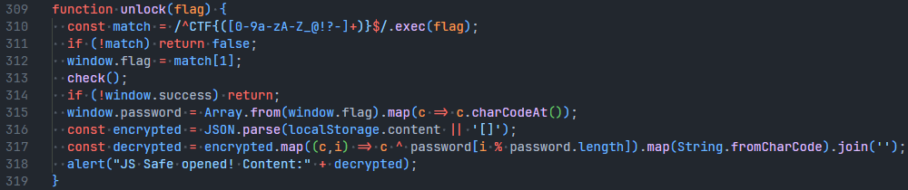
先檢查輸入是否符合 `/^CTF{([0-9a-zA-Z_@!?-]+)}$/`，再進入到 `check()`  
接下來的 encrypted 跟 decrypted 就不重要了

##### check()
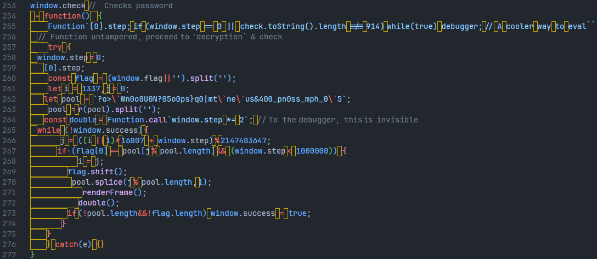
定義於 [anti(debug)](#anti(debug)) 中

#### store
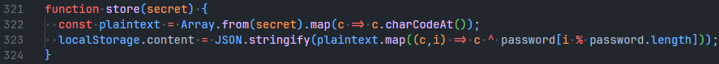

老實說這邊不太重要，畢竟題目說明也有提到 Flag 不在你電腦上

## Challenge Solving
### Escape Anti-Debugger
一開始我被兩個長度檢查擋下，導致我無法修改檔案中的任何內容
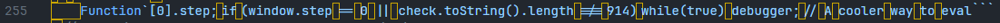
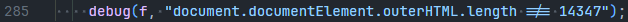

看起來第二個長度檢查與整個 HTML 檔案較為有關連，因此我先修改並使他永遠是 false，這樣我就可以隨意更改內容
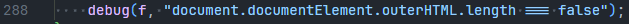

改完重新整理後得到新的錯誤
> Refused to execute inline script because it violates the following Content Security Policy directive: "script-src 'sha256-P8konjutLDFcT0reFzasbgQ2OTEocAZB3vWTUbDiSjM=' 'sha256-eDP6HO9Yybh41tLimBrIRGHRqYoykeCv2OYpciXmqcY=' 'unsafe-eval'". Either the 'unsafe-inline' keyword, a hash ('sha256-nArgG/Kg8kEACs2owqJeoSo4GHMLDdMGC8GlH/i+HGg='), or a nonce ('nonce-...') is required to enable inline execution.

依據錯誤訊息，將 `Content-Security-Policy` 兩個 sha256 刪除並修改為
```html
<meta http-equiv="Content-Security-Policy" id="c" content="script-src 'unsafe-inline' 'unsafe-eval'">
```

重新整理並依照題目要求的操作測試，發現能夠正常運作，現在我可以隨意修改檔案內容並進行各種測試與分析  
但 Console 一直被覆蓋與清除有點煩因此我把下面兩行註解，讓 Console 變乾淨，同時將 unlock 一些沒用的程式註解
```javascript
...
// console.clear();
// console.log(content);
...
//   alert("JS Safe opened! Content:" + decrypted);
...
```

### Problem
接下來可以解開題目了！先將目光放在 `check` 函數上
```javascript
window.check // Checks password
 = function() {
    Function`[0].step; if (window.step == 0 || check.toString().length !== 914) while(true) debugger; // Aﾠcooler wayﾠto eval```
    // Functionﾠuntampered,ﾠproceed to 'decryption` & check
    try {
    window.step = 0;
    [0].step;
    const flag = (window.flag||'').split('');
    let iﾠ= 1337, j = 0;
    let pool =ﾠ`?o>\`Wn0o0U0N?05o0ps}q0|mt\`ne\`us&400_pn0ss_mph_0\`5`;
    pool = r(pool).split('');
    const double = Function.call`window.stepﾠ*=ﾠ2`;ﾠ// To the debugger,ﾠthis isﾠinvisible
    while (!window.success) {
        j = ((iﾠ|| 1)* 16807 + window.step) % 2147483647;
        if (flag[0] == pool[j % pool.length] && (window.step < 1000000)) {
            iﾠ= j;
            flag.shift();
            pool.splice(j % pool.length, 1);
            renderFrame();
            double();
            if (!pool.length&&!flag.length) window.success = true;
        }
    }
    } catch(e) {}
}
```

發現這段似乎還會針對 `check` 進行長度的檢查，所以可以跟之前一樣修改掉
```diff
- Function`[0].step; if (window.step == 0 || check.toString().length !== 914) while(true) debugger; // Aﾠcooler wayﾠto eval```
+ Function`[0].step; if (window.step == 0 || check.toString().length === false) while(true) debugger; // Aﾠcooler wayﾠto eval```
```

最後修改 `while (!window.success) { ... }` 中的內容，將 Flag 的每個字元輸出
```javascript
    while (!window.success) {
        j = ((iﾠ|| 1)* 16807 + window.step) % 2147483647;
        if (flag[0] == pool[j % pool.length] && (window.step < 1000000)) {
a+=pool[j % pool.length];
            iﾠ= j;
            flag.shift();
           pool.splice(j % pool.length, 1)
            renderFrame();
            double();
            if (!pool.length&&!flag.length) window.success = true;
        }
    }
console.log(a)
    } catch(e) {}
```

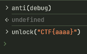

頁面當掉？  
到這邊比賽結束，這時題目未解開

### Problem Solving
2025/07/04 我解決頁面當掉問題，將 `while (!window.success) { ... }` 中的這個 if 拿掉 or 註解
```javascript
if (flag[0] == pool[j % pool.length] && (window.step < 1000000)) { }
```
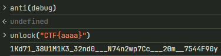

看起來不太對

交棒給 [@jimchen5209](https://github.com/jimchen5209)

遇事不決決定在 `check()` 的一個地方新增一個斷點來「偵錯」，接著發現這函式不管怎麼戳都新增不了斷點，只能新增在剛剛加上的那一行，儘管加上去了，實際執行的時候卻發現那個斷點直接被跳過了

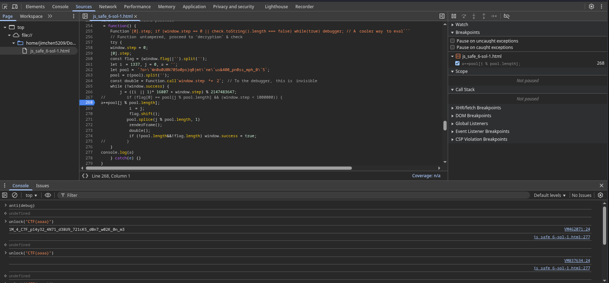

既然無法直接「偵錯」`check()`，那就來「偵錯」他有用到的函式，再觀察一次 `check()` 函式，函式有用到 `window.step`、`window.flag`、`window.r`，其中 `window.step` 會影響解密的內容，`window.r` 是準備要被檢查的字串，而 `window.r` ROT47 函式被 `pool = r(pool).split('');` 呼叫了一次，於是將斷點新增在 `check()` 上幾行的 `window.r` 上

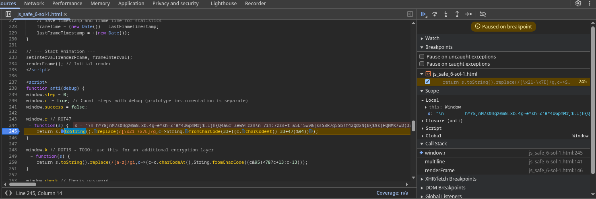

此時發現這個斷點立刻被觸發了，明明還沒有執行 `check()` 函式，此時觀察一下傳入之 `s` 的內容

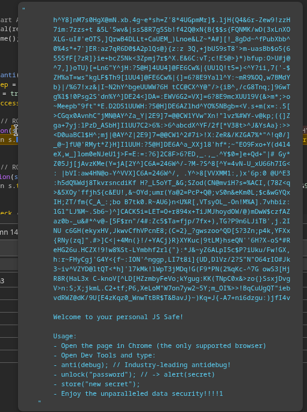

發現他就是畫面上的背景圖，出於好奇直接開始按 Step Over 按鈕，看他回傳的位置

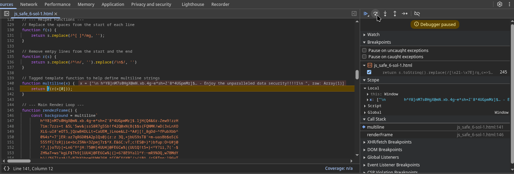

此時停在 `multiline()` 函式上，這時觀察到這裡發生的事：底下不斷執行的 `renderFrame()` 函式第一行定義 `background` 的時候就呼叫了 `multiline()`，而他原先要執行上面的 `r()` 函式，但是下 `anti(debug)` 時 `r()` 被取代成轉換 ROT47 的 `window.r` 函式，而偵錯工具現在停在 `r()` 執行完要準備傳入 `f()` 中，於是按了 Step in 按鈕來看他會傳入哪個函式

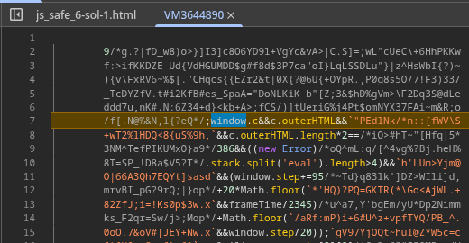

正當我以為他會傳入到上方的 `f()` 時，他卻進入了一個神奇的區塊，看了一下程式結構發現跟 `background` 是一樣的，推測是 ROT47 解出來的字串，裡面竟然藏著可執行的 JS 程式，在這邊能發現有一個檢查，而這個檢查會直接影響 `window.step`的值，導致解碼出現偏差：

```javascript
c.outerHTML.length*2 == 386 && (new Error).stack.split('eval').length>4
```

尋找 `c` 的定義，發現在 `anti()` 函式中有定義 `window.c`，不過他有長的很像空格的其他字元，絕對不是只有 `true` 這麼簡單  
> ~~此 c 非彼 c~~

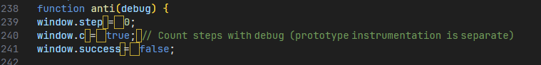

於是回到偵錯工具，既然他停在上面，可以觀察一下 `c.outerHTML` 的內容

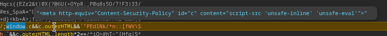

可以發現內容其實就是修改過的 `Content-Security-Policy` Header，正因為修改過，解出來的內容不正確
但是這裡的內容是透過 ROT47 解出來的程式碼，無法直接對其修改，因此再次修改 `Content-Security-Policy`，用空格補齊到原本內容的長度

```diff
-<meta http-equiv="Content-Security-Policy" id="c" content="script-src 'unsafe-inline' 'unsafe-eval'">
+<meta http-equiv="Content-Security-Policy" id="c" content="script-src                                                                                             'unsafe-inline' 'unsafe-eval'">
```

將這個 `window.step` 變因排除掉後，再試一次就會得到疑似 Flag 的字串

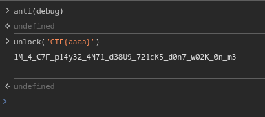

此時開啟原始 JS Safe 檔案，輸入這個 Flag 字串驗證，發現可以正確解鎖

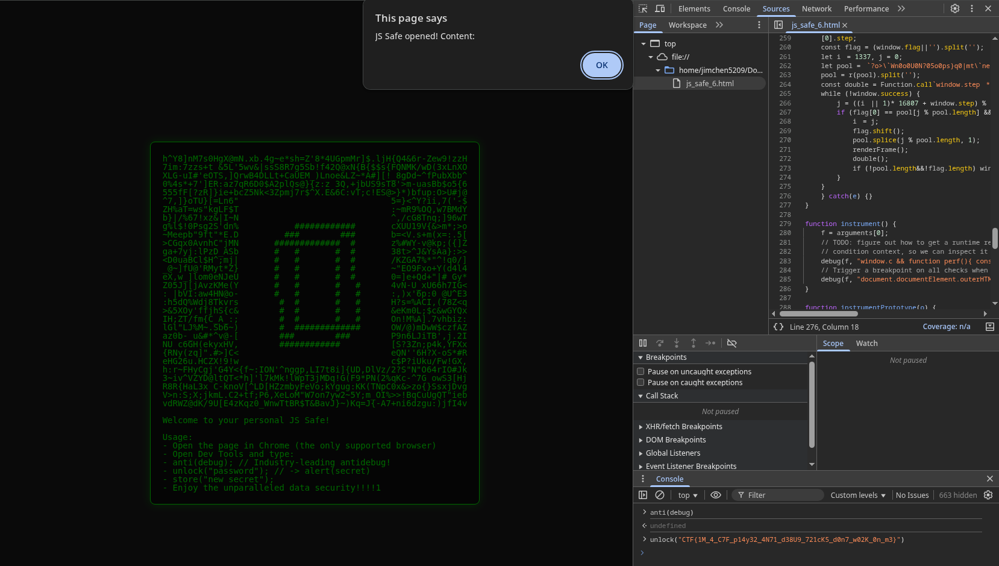

## References
- [kalmarunionen/NicolaiSoeborg CTF Writeup](https://github.com/NicolaiSoeborg/ctf-writeups/blob/master/2025/Google%20CTF%202025/README.md)
  - 這一個 Write-up 提點了我很多，也讓我知道缺少了什麼部分
