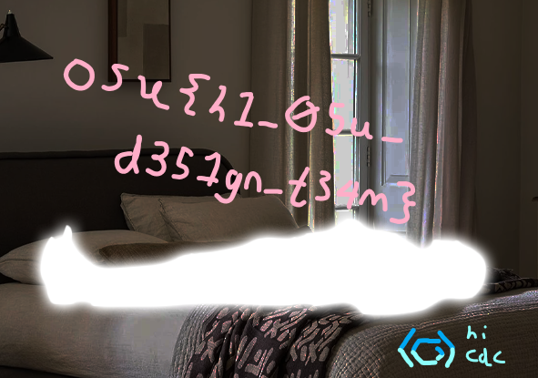

# crypto/beyond-wood

by WoodMan

## Summary

> spinning white floating glowing man in forest

## Challenge Solving

```python
from PIL import Image
from collections import Counter

output = Image.open("output.png")
width, height = output.size

def modinv(a, m):
    def egcd(a, b):
        if a == 0:
            return b, 0, 1
        g, x1, y1 = egcd(b % a, a)
        return g, y1 - (b // a) * x1, x1
    g, x, _ = egcd(a % m, m)
    return (x % m + m) % m if g == 1 else None

inv_727_w = modinv(727, width)
inv_727_h = modinv(727, height)

def reverse_position(newi, newj):
    i = ((newi - 2134266) * inv_727_w) % width
    j = ((newj - 4501511) * inv_727_h) % height
    return i, j

unshuffled = Image.new("RGB", (width, height))
for newi in range(width):
    for newj in range(height):
        i, j = reverse_position(newi, newj)
        unshuffled.putpixel((i, j), output.getpixel((newi, newj)))

all_pixels = [unshuffled.getpixel((i, j)) for i in range(width) for j in range(height)]
encrypted_bg = Counter(all_pixels).most_common(1)[0][0]

for assumed_bg, outname in [((255, 255, 255), "decrypted_white_bg.png"),
                            ((0, 0, 0), "decrypted_black_bg.png")]:
    key = tuple(e ^ a for e, a in zip(encrypted_bg, assumed_bg))
    decrypted = Image.new("RGB", (width, height))
    for i in range(width):
        for j in range(height):
            p = unshuffled.getpixel((i, j))
            decrypted.putpixel((i, j), tuple(px ^ k for px, k in zip(p, key)))
    decrypted.save(outname)
```



## Flag

`osu{h1_0su_d351gn_t34m}`
