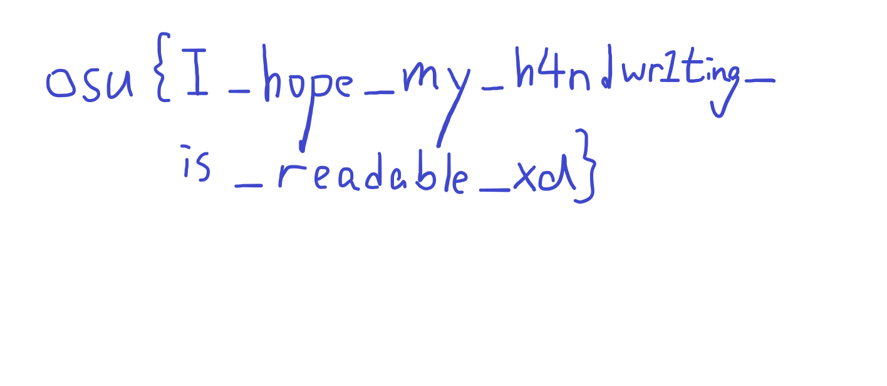

# forensics/map-dealer

by WoodMan

## Summary

> We have confiscated a USB drive from sahuang, whom we were informed was trying to sell a beatmap containing some confidential data of the community to the dark web. However, the beatmap was nowhere to be found from the drive when we mounted it to our computer. Can you help recover it?

## Challenge Solving

1. `tar -xvf forensics_map-dealer.tar.gz`
2. `ewfmount Sandisk.E01`
3. `fls -r ewf/ewf1`
4. `icat ewf/ewf1 8202 > "recovered_sahuang_secret_map.osz"`
5. `unzip recovered_sahuang_secret_map.osz`
6. read flag.png

   

## Flag

`osu{I_hope_my_h4ndwr1ting_is_readable_xd}`

