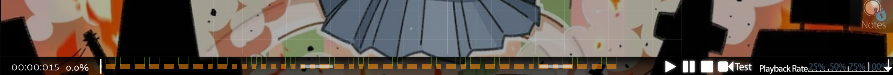

# kaijuu/oddly-easy

by jimchen5209

It's kind of brute forcing, but I can't find a better way to solve this Morse code.

> [!NOTE]
> This is solved after the CTF ended, and the flag is unofficial, sent by community.

## Summary

> The EASY diff looks so easy, surely it's not hiding anything?  
> Wrap the flag in `osu{}`. All lowercase.  
> Note: Flag length (without `osu{}`) is 10.

## Files Provided

- 2454199 Sakuzyo feat. Hatsune Miku - Kaijuu ni Naritai.osz
  > Downloaded from https://osu.ppy.sh/beatmapsets/2454199 provided in the [sanity-check](../sanity-check/README.md) challenge.

## File Analysis

It's an osu! beatmap pack, containing difficulty `EASY`.

Open the Easy Difficulty with Editor, you'll find out the kiai section is kind of wierd.



Looks like a morse code, written `-------.-.........--..--.--.-.----.-.----` .

But this cannot be decoded directly.

## Challenge Solving

There's a special script from community, uses dynamic programming/BFS to decode Morse code and find all possible decoding results of exactly 10 letters.

```python
morse_str = "-------.-.........--..--.--.-.----.-.----"

decoded = [
    'a','b','c','d','e','f','g','h','i','j','k','l','m','n','o','p','q','r','s','t',
    'u','v','w','x','y','z',
    '0','1','2','3','4','5','6','7','8','9',
    '.', ',', '?', "'", '!', '/', '(', ')', '&', ':', ';', '=', '+', '-', '_', '"', '$', '@'
]

morse = [
    ".-", "-...", "-.-.", "-..", ".", "..-.", "--.", "....", "..", ".---", "-.-", ".-..",
    "--", "-.", "---", ".--.", "--.-", ".-.", "...", "-", "..-", "...-", ".--", "-..-",
    "-.--", "--..",
    "-----", ".----", "..---", "...--", "....-", ".....", "-....", "--...", "---..", "----.",
    ".-.-.-", "--..--", "..--..", ".----.", "-.-.--", "-..-.", "-.--.", "-.--.-", ".-...",
    "---...", "-.-.-.", "-...-", ".-.-.", "-....-", "..--.-", ".-..-.", "...-..-", ".--.-."
]

# Morse → character dictionary
morse_to_char = dict(zip(morse, decoded))

n = len(morse_str)

# --- Step 1: Build skip table ---
next_valid = [[] for _ in range(n)]
max_len = max(len(m) for m in morse)
min_len = min(len(m) for m in morse)

for i in range(n):
    for L in range(min_len, min(max_len, n - i) + 1):
        seg = morse_str[i:i + L]
        if seg in morse_to_char:
            next_valid[i].append((i + L, morse_to_char[seg]))

# --- Step 2: DP / BFS decode with skip table and length tracking ---
ans_list = [set() for _ in range(n + 1)]
ans_list[0].add(("", 0))  # (decoded_string, decoded_length)

for i in range(n):
    if not ans_list[i]:
        continue
    for nxt, ch in next_valid[i]:
        for prefix, plen in ans_list[i]:
            new_len = plen + 1
            # Only continue building if we can still reach length 10
            if new_len <= 10:
                ans_list[nxt].add((prefix + ch, new_len))

# --- Step 3: Collect only decoded strings of length exactly 10 ---
results = {s for s, l in ans_list[n] if l == 10}

print(f"Found {len(results)} result(s) of length 10:")
for r in sorted(results):
    print(r)
```

<details>
<summary>Broken down step by step by Claude.</summary>

## Step 1: Create a skip table

```python
next_valid[i].append((i + L, morse_to_char[seg]))
```

For each position `i`, pre-calculate which Morse letters can match starting from that position.

* Record: the next position `i+L` to jump to, and the corresponding letter `ch`
* For example: if `.-` starting at position 3 is the letter 'a', then record `(5, 'a')`

## Step 2: Dynamic Programming Decoding

```python
ans_list[0].add(("", 0)) # Starting point: empty string, length 0
```

* `ans_list[i]` stores all possible (string, length) combinations when decoding to position `i`
* For each position `i`, try all possible next letters
* Only keep those with length ≤ 10 Candidates (pruning optimization)

## Step 3: Collect Results

```python
results = {s for s, l in ans_list[n] if l == 10}
```

* From all decoding results at the last position `n`, filter out strings with a length of exactly 10.

## Summary

This program handles the ambiguity of Morse code:

* The same symbol sequence can be split in multiple ways.
* For example, `.-` can be either `a` or `e` + `t`.
* The program finds all possible decodings but only outputs those with a length of 10.
</details>

The script Found 5504 result(s) of length 10, the one that look like word is most likely the flag.

> HOW!?

## Flag

`osu{m0r53_k1a1}`


