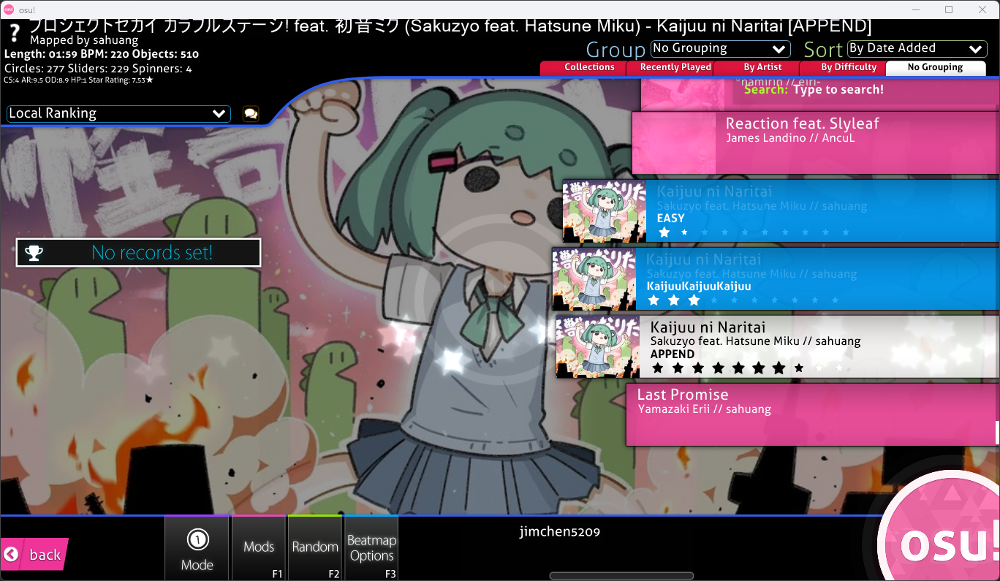
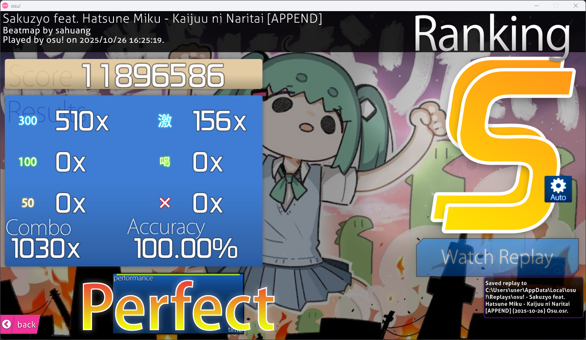
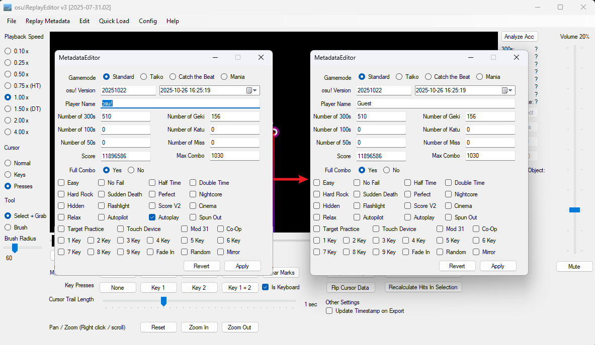

# kaijuu/ss-me

by jimchen5209

## Summary

> Can you SS APPEND? Do not use Auto to cheat...
> Note: No Mod only. Do not add any modes.
>
> `nc ss-me.challs.sekai.team 1337`

## Files Provided

- 2454199 Sakuzyo feat. Hatsune Miku - Kaijuu ni Naritai.osz
  > Downloaded from https://osu.ppy.sh/beatmapsets/2454199 provided in the sanity-check challenge.

## File Analysis

It's an osu! beatmap pack, containing one beatmap of 7.5 stars difficulty.

You need a replay file with ss score for this beatmap, a 7.5 star map, without any mod.



## Challenge Solving

The challenge looks easy with osu! pro, but I can't beat it my self, but there's still a way, you need [stable](https://osu.ppy.sh/home/download) for this.

1. Go play with auto, and hit F2 to export the auto play replay.
  

2. We need to modify this replay file to remove the evidence of auto play.
    We'll use [thebetioplane/osuReplayEditorV3](https://github.com/thebetioplane/osuReplayEditorV3) for this.

    Open the tool, load the replay file, change the Player Name other than `osu!` and untick all mods, then export the replay file, make sure filename ends with the Player Name you changed.

    

3. After this, you need a little python script to submit the replay file.
    ```python
    from base64 import b64encode
    from pwn import *  # python3 -m pip install pwntools

    io = remote('ss-me.challs.sekai.team', 1337)
    io.sendline(b64encode(open('./replay.osr', 'rb').read()))
    io.interactive()

    ```

    Install the `pwntools` dependency and run it, and you'll get the flag from the response.

## Flag

`osu{I_th1nk_u_St1LL_ch34t3d_w1th_AU70!}`
