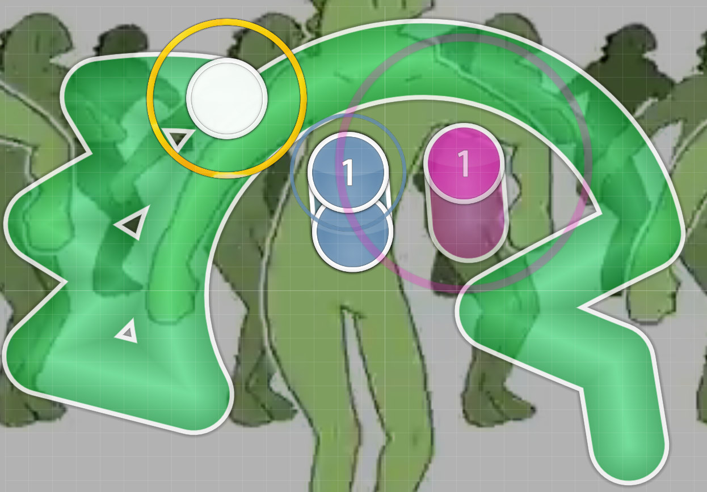
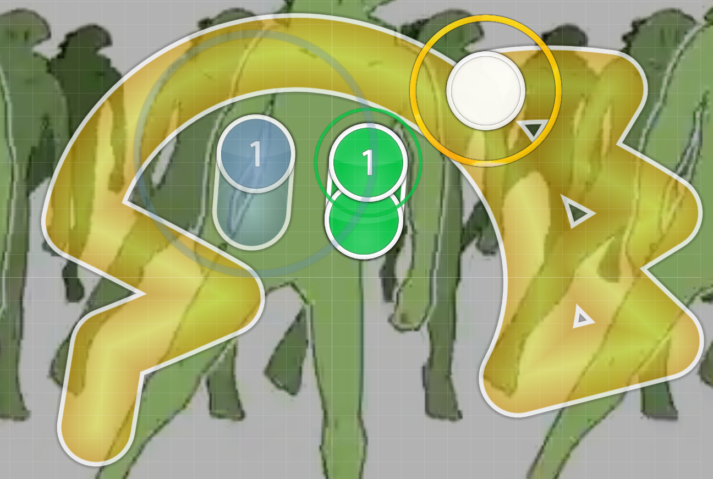

# kaijuu/怪獣怪獣怪獣怪獣怪獣怪獣怪獣

by jimchen5209

> [!NOTE]
> This is solved after the CTF ended, and the flag is unofficial, sent by community.

## Description

> I can only see 怪獣 in my nightmare...
> Wrap flag in `osu{...}` to submit.

## Files Provided

- 2454199 Sakuzyo feat. Hatsune Miku - Kaijuu ni Naritai.osz
  > Downloaded from https://osu.ppy.sh/beatmapsets/2454199 provided in the [sanity-check](../sanity-check/README.md) challenge.

## File Analysis

It's an osu! beatmap pack, containing difficulty `KaijuuKaijuuKaijuu`.

The whole map contains two pattern:

- A kaijuu facing right, we'll call it `R`.

  
- A kaijuu facing left, we'll call it `L`.

  

## Challenge Solving

After playing the whole map, we get `RLLRLRRLRRLRLLLRRLLLRRLLRLRLRRRLRLRRLRLRLRLRLLLLR`.

This is a 7bits encoded ASCII, with length 49, assuming `R` is `1` and  `L` is `0`.

We have `1001011011010001100011001010111010110101010100001`.

Grouping it with 7-bit and get the corrosponded ASCII letter.

```
1001011 0110100 0110001 1001010 1110101 1010101 0100001
   K       4       1       J       u       U       !
```

## Flag

`osu{K41JuU!}`

## Sources
- [ASCII Table (7-bit) - ASCII Code](https://www.ascii-code.com/ASCII)
