# osint/weebbolt

by WoodMan, jimchen5209

## Summary

> This challenge is a lot more fun when you're a weeb.  
> https://weebbolt-web.challs.sekai.team

## Challenge Solving

A website with 10 pictures is provided.  
Each picture contains a clue to a specific location. Guess the location based on picture, when you get 9 out of 10 correct locations, you will get the flag.

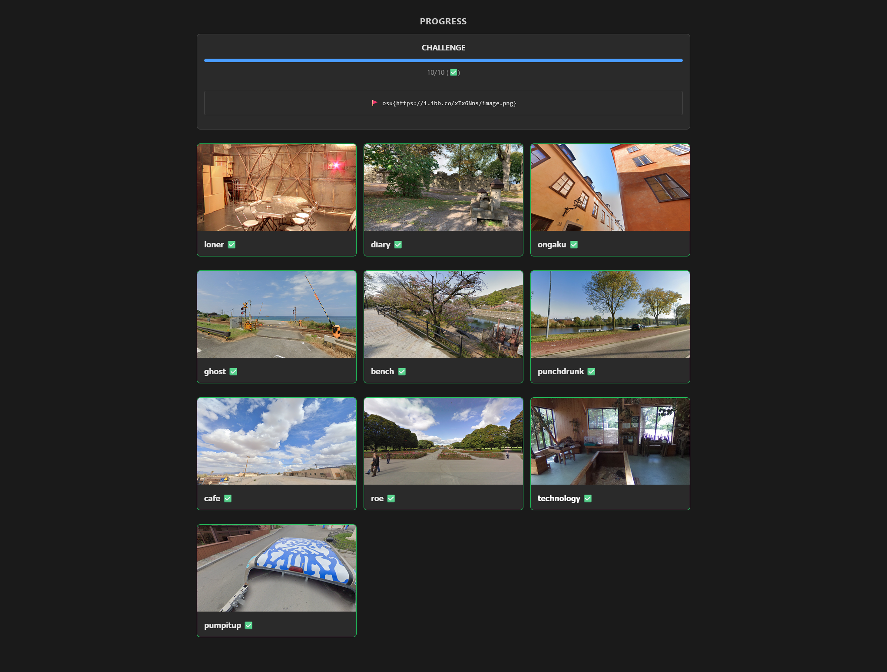

The 10 locations are:
1. loner

   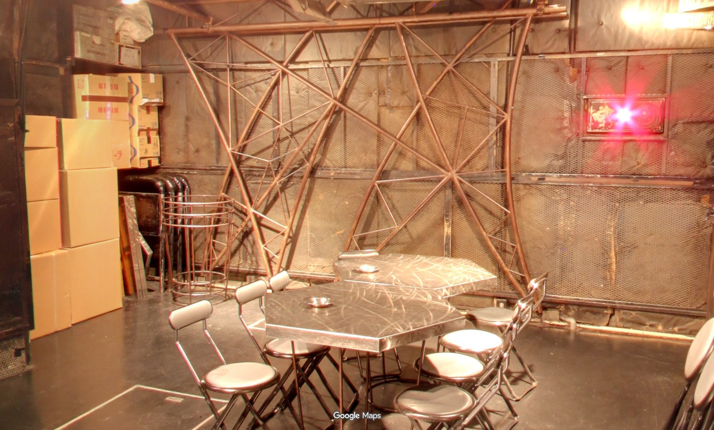
   * Location: Shimokitazawa SHELTER

     https://maps.app.goo.gl/jSvn3U2n4vb3gzL8A

     
2. diary

   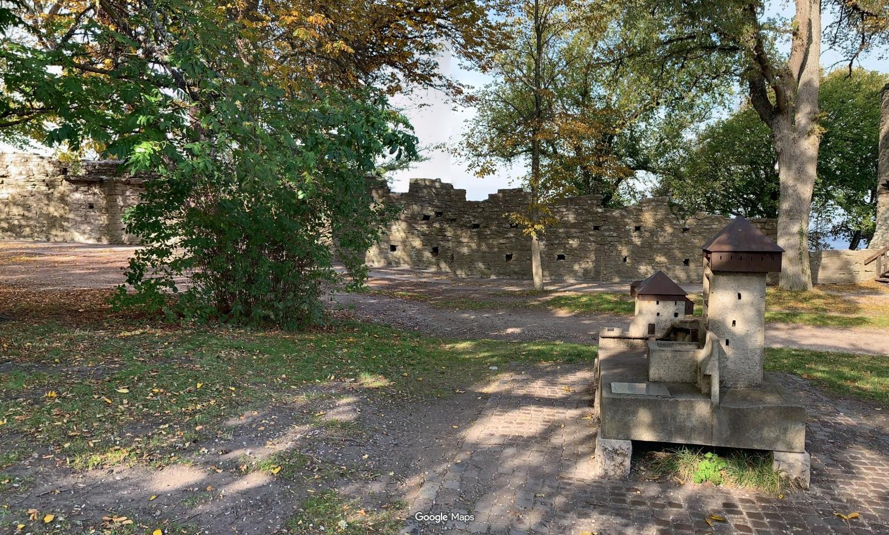
   * Location: Nearby Snäckgärdsporten 

     https://maps.app.goo.gl/nGEoW1JoQ6QkNBu4A

     
3. ongaku

   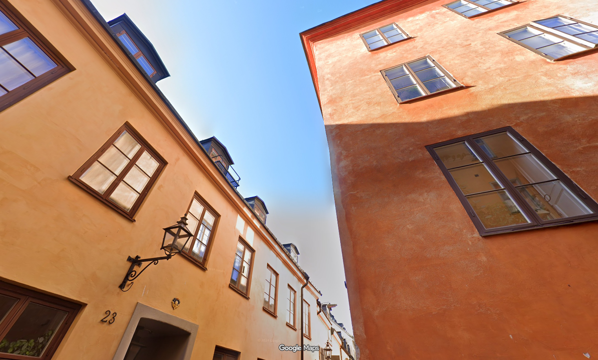
   * Location: Tyska skolgränd

     https://maps.app.goo.gl/sBQZx1p89EczoPjP8

     
4. ghost

   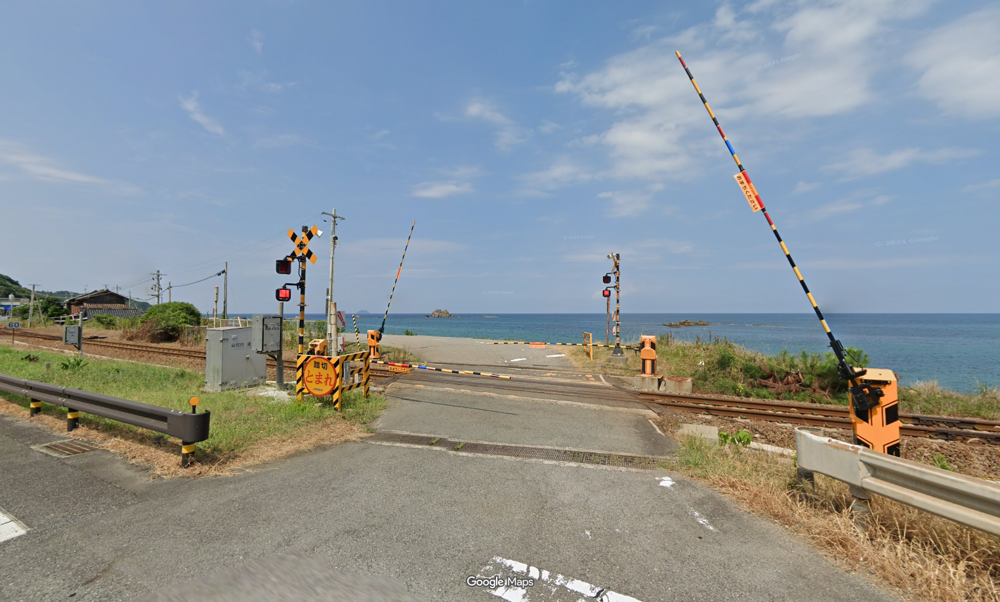
   * Location: The intersection near Orii Station

     https://maps.app.goo.gl/VhrkZphM8kj5efAq7

     
5. bench

   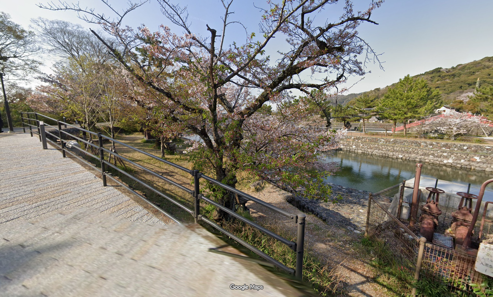
   * Location: Byōdo-in Temple

     https://maps.app.goo.gl/4VYfb96i6HHcGdEd9

     
6. punchdrunk

   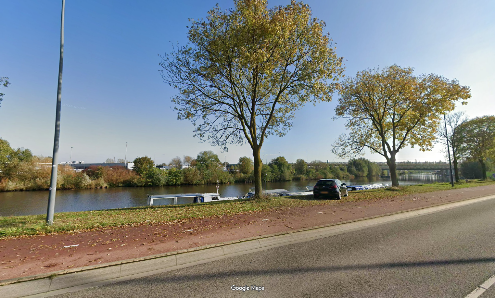
   * https://liquipedia.net/osu/GTS/COE/2025
   * Location: Nearby Brabanthallen 's-Hertogenbosch

     https://maps.app.goo.gl/WGy5qokD6y6LHEgS6

     
7. cafe

   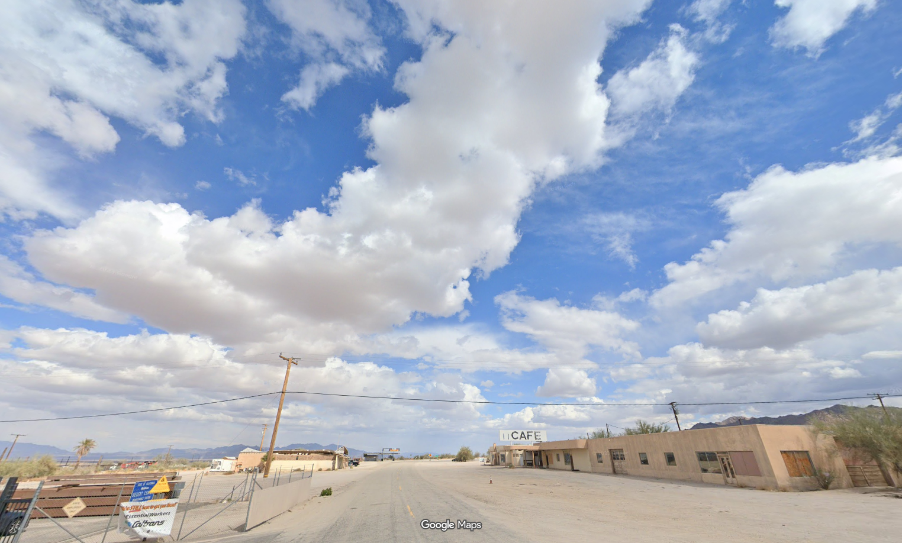
   * Location: Desert Center Cafe

     https://maps.app.goo.gl/gNeBC8Q1aM5yWJnr8

     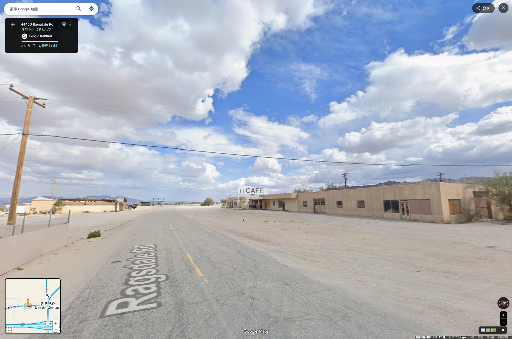
8. roe

   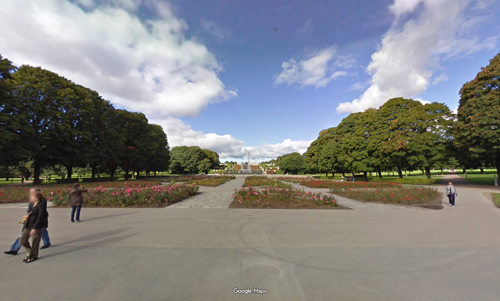
   * Location: Frognerparken near Vigelandsparken

     https://maps.app.goo.gl/9aZbCjNitYCQb5NW7

     
9. technology

   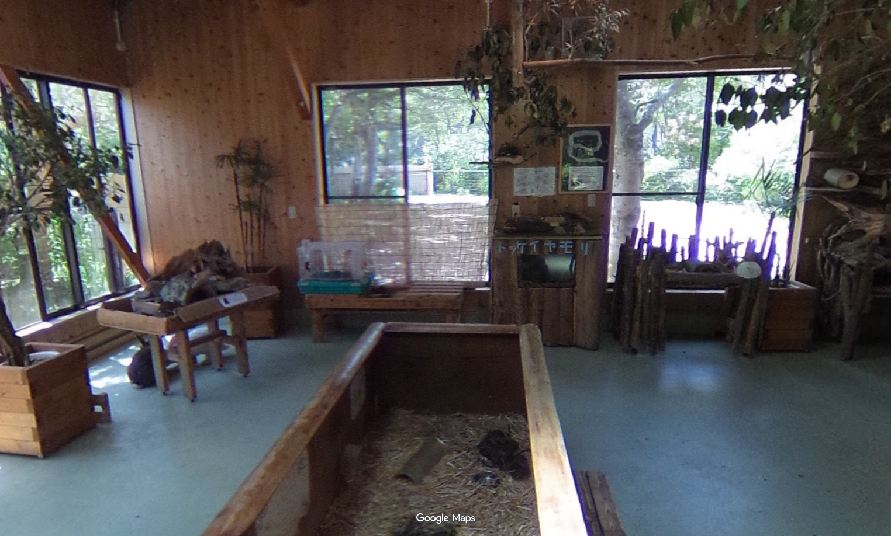
   * Location: Nagasaki Bio Park

     https://maps.app.goo.gl/hX3T25dLBMxHDzvWA

     
10. pumpitup

    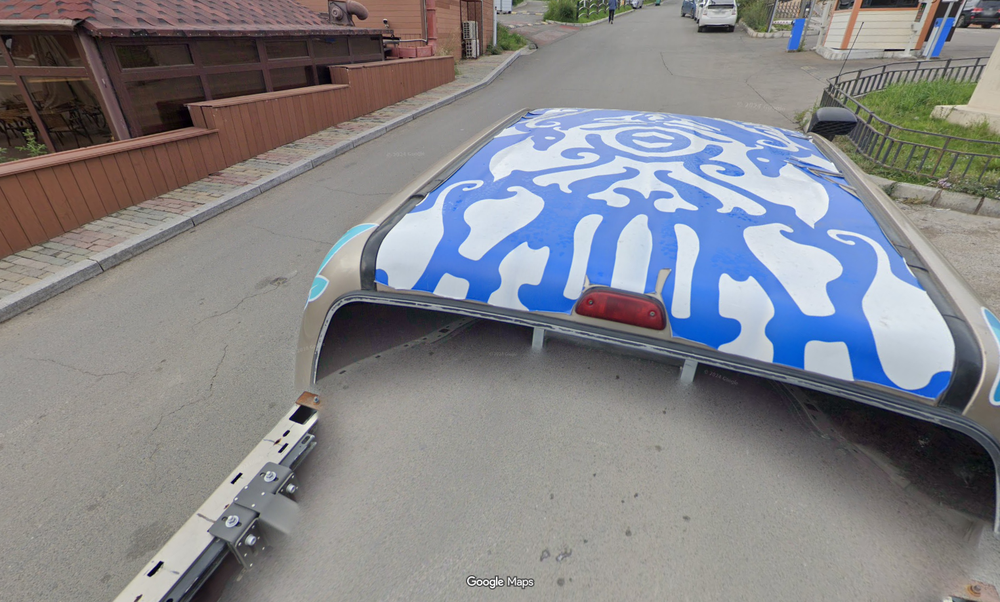
    * Location: The entrance to the public parking lot at the intersection of Ulaanbaatar Zaisan Monument.

      https://maps.app.goo.gl/1oXn9NWtZ893wyRD9

      

## Flag

`osu{https://i.ibb.co/xTx6Nns/image.png}`

