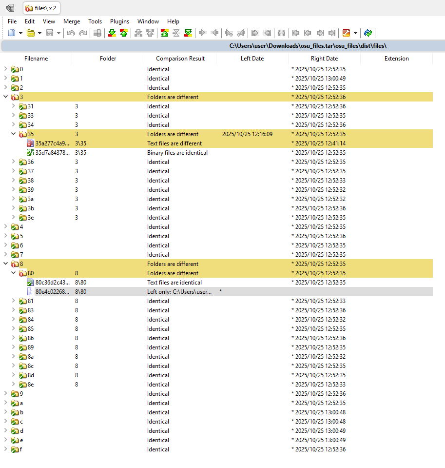

# osu/files
by jimchen5209

## Summary

> My filesystem got corrupted somehow... can you find the odd one out? The flag is the file name that doesn't belong, wrapped in `osu{}`.

## Files Provided

- `osu_files.tar.gz`

## File Analysis

File contains a Storage structure of osu! lazer but missing index, which contains the installed beatmaps.

[File storage in osu!(lazer) · wiki](https://osu.ppy.sh/wiki/en/Client/Release_stream/Lazer/File_storage)

Dive into the folder, check if there's a file not following the file structure with the following command:

```shellscript
tree -a
```

Output: Shown in [output/file_structure.txt](output/file_structure.txt)


But with no luck, every file looks legit.

Then there may be something broken with the file content.

## Challenge Solving
For this,  you need a fresh install of osu! [lazer](https://osu.ppy.sh/home/download) to compare with.

There should be at least one metadata file ended with `.osu` in each beatmap set, for example:


A newer beatmap file format may contain a field called `BeatmapSetId`, which is registered on the osu! website.

For example: `BeatmapSetID:1660279`

Once you get the id, head into osu website to download the beatmap with the link below:

https://osu.ppy.sh/beatmapsets/1660279

And now search for the `BeatmapSetID` in the folder, and download all the map mentioned.


You can replace the specific id to help filtered the downloaded beatmap set, but make sure you have copy the original folder first, we'll need it later.


You may see the id of -1, but it may be the default map for intro (e.g. triangle for osu!lazer's intro music), you can ignore for now.


The rest beatmap I found:

- https://osu.ppy.sh/beatmapsets/1908399
- https://osu.ppy.sh/beatmapsets/2237410
- https://osu.ppy.sh/beatmapsets/2214814

Now head into a fresh osu! lazer install and import these map, once imported, head into settings and open osu! folder.


You'll see a folder named `files`.


Now we can use a folder compare tool to compare the `files` folder with the provided `files` folder, for example, [WinMerge](https://winmerge.org/) on Windows or `diff` command on Linux/Mac. You'll see the files differs has been filtered out, including files missing in one side.


Open one of a file differed, check the content of file, for example, this file (`1281cec186d436b8e1e2ceccec222d96fc028e353e54c97410d4581a58556529`) contains the beatmap without beatmap id, seems to be an old file format, so search for the map using the info provided, for example, title and creator.


Then I found an another beatmap set:

- https://osu.ppy.sh/beatmapsets/39804

Download and import this map, and refresh the folder compare. Now there's two files differs left.



The one that have been left over is the answer of this.


## Flag

`osu{80e4c02268d49ca010e3c62fcc2615da2fad4cf0c359eb8fedc0366739b34205}`

## Bottom Line

- Fun fact: The artist of circles is nekodex, not cYsmix.
- This player must be the fan of Freedom Dive.

